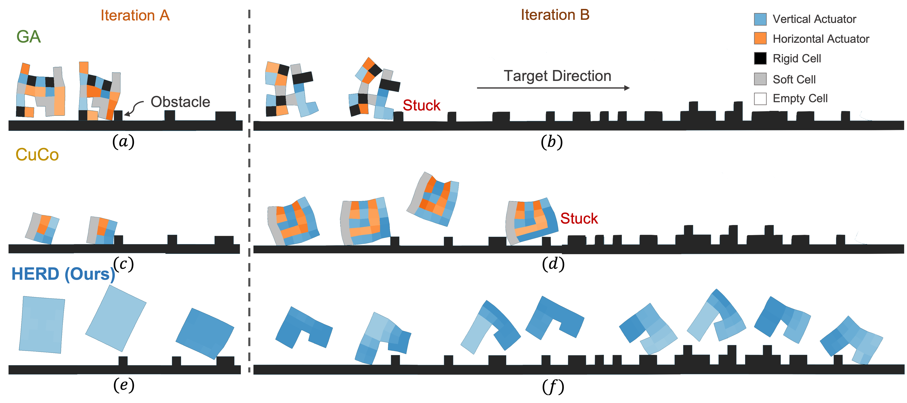
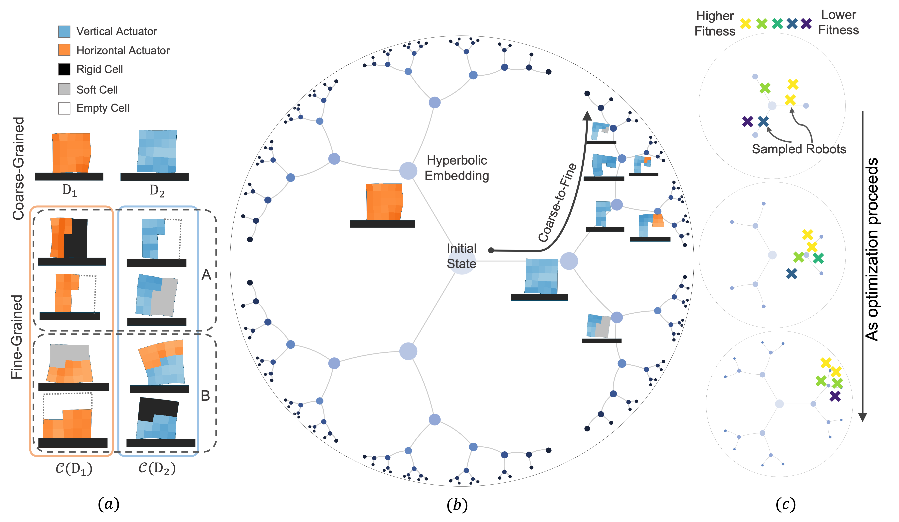
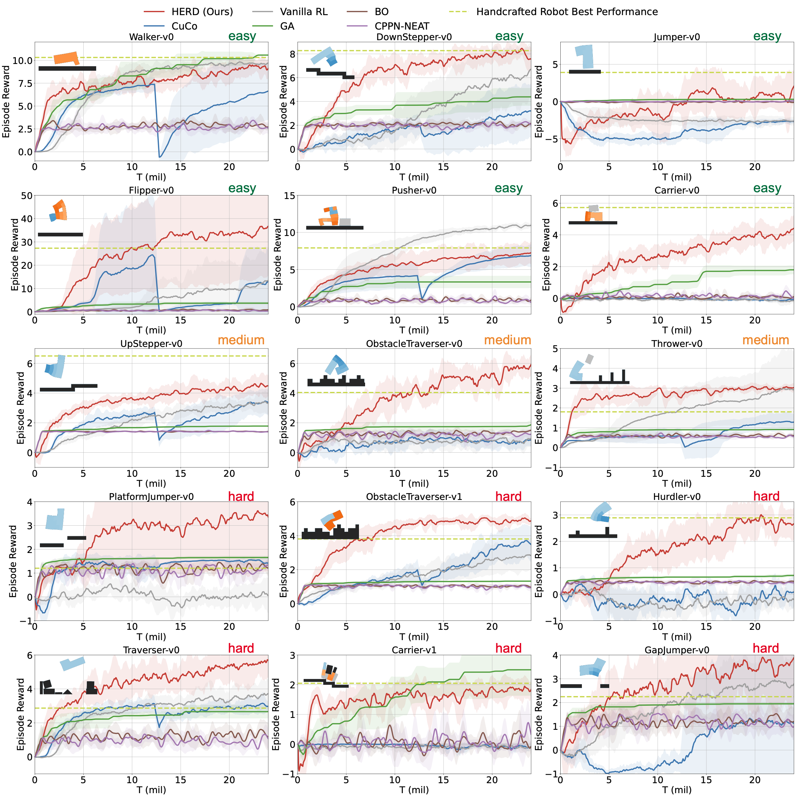
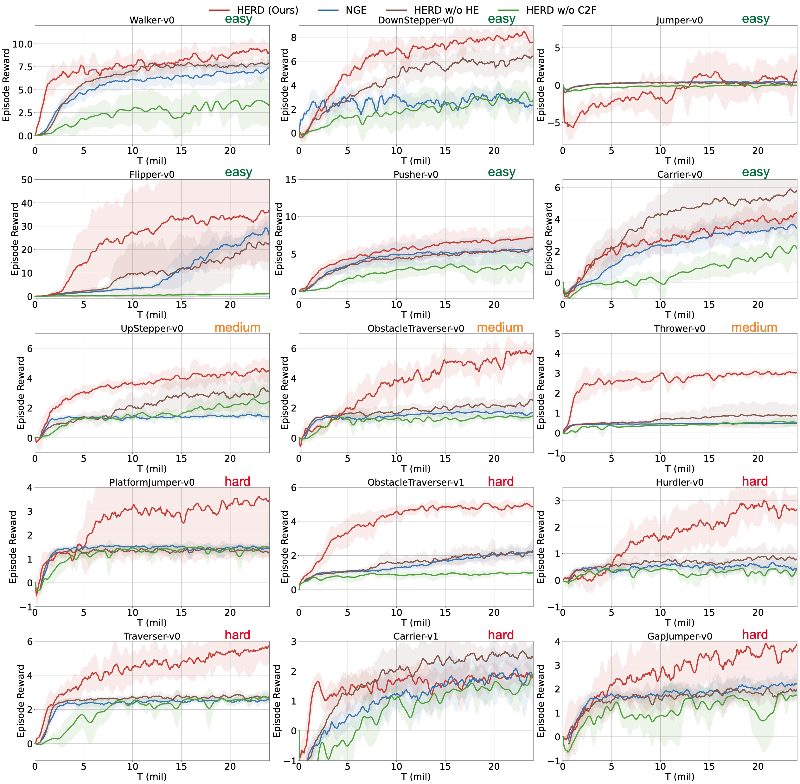
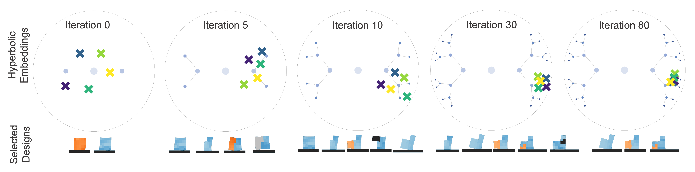

# HERD

Code for "Leveraging Hyperbolic Embeddings for Coarse-to-Fine Robot Design".

This work is based on [EvolutionGym [1]](https://github.com/EvolutionGym/evogym) and [ModularEvoGym [2]](https://github.com/Yuxing-Wang-THU/ModularEvoGym).



## Framework




## Installation
Install Python dependencies
```bash
sudo apt-get install xorg-dev libglu1-mesa-dev
conda create -n modularevogym python==3.7.11
conda activate modularevogym
pip install -r requirements.txt -i https://pypi.tuna.tsinghua.edu.cn/simple/
pip install Gpy==1.10.0 -i https://pypi.tuna.tsinghua.edu.cn/simple/
pip install git+https://github.com/yunshengtian/GPyOpt.git
pip install git+https://github.com/yunshengtian/neat-python.git
```

To build the C++ simulation, build all the submodules, and install evogym run the following command:
```bash
python setup.py install
```

if you meet this error "Could NOT find GLEW (missing: GLEW_INCLUDE_DIRS GLEW_LIBRARIES)", run
```bash
sudo apt install libglew-dev
```

## Training & Save Replay

### From Terminal

```bash
python ModularEvoGym/examples/run_codesign.py 
--threads_num 4
--seed 0
--device_num 0
--train_iters 3000
--save_replay 0
```

### From VSCode

Config `launch.json`
```json
{
    "version": "0.2.0",
    "configurations": [
        {
            "name": "codesign_${config:numRun}",
            "type": "python",
            "request": "launch",
            "program": "ModularEvoGym/examples/run_codesign.py",
            "console": "integratedTerminal",
            "env":{
                "CUDA_VISIBLE_DEVICES": "${config:numRun}",
            },
            "args": [
                "--threads_num", "4",
                "--seed", "${config:numRun}",
                "--device_num", "${config:numRun}",
                "--train_iters", "3000",
                "--save_replay", "0",
            ],
            "justMyCode": false
        }, 
    ]
} 
```

Config `settings.json`
```json
{
    "numRun": "0",
}
```

To save replay during training, simply set `--save_replay 1`.


## Results

### Training Performance



### Ablation Studies



### Design Analysis




## References

[1] Jagdeep Bhatia, Holly Jackson, Yunsheng Tian, Jie Xu, and Wojciech Matusik. Evolution gym: A large-scale benchmark for evolving soft robots. In NeurIPS, 2021.

[2] Yuxing Wang, Shuang Wu, Haobo Fu, Qiang Fu, Tiantian Zhang, Yongzhe Chang, and Xueqian Wang. Curriculum-based co-design of morphology and control of voxel-based soft robots. In The Eleventh International Conference on Learning Representations, 2022.
